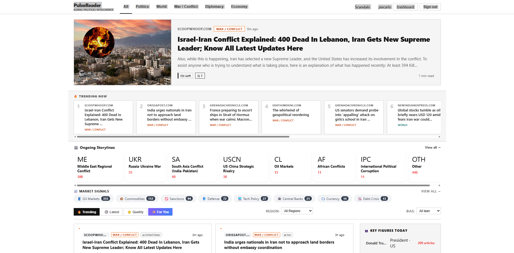

# News



## Setup

```bash
npm install
cp .env.example .env   # fill in your values
```

## Environment Variables

Create a `.env` file based on `.env.example`:

| Variable | Description |
|---|---|
| `MONGO_URI` | MongoDB connection string (local or Atlas) |
| `JWT_SECRET` | Long random string for signing JWTs |
| `PORT` | Server port (default: `3000`) |
| `NODE_ENV` | `development` or `production` |
| `OPENAI_API_KEY` | [OpenAI](https://platform.openai.com/api-keys) — article analysis |
| `NEWSAPI_KEY` | [NewsAPI.org](https://newsapi.org) |
| `NEWSAPI_AI_KEY` | [NewsAPI.ai](https://www.newsapi.ai) |
| `WEBZ_KEY` | [Webz.io](https://webz.io) |
| `WORLDNEWS_KEY` | [WorldNewsAPI](https://worldnewsapi.com) |
| `NEWSDATA_KEY` | [NewsData.io](https://newsdata.io) |
| `THENEWSAPI_KEY` | [TheNewsAPI](https://www.thenewsapi.com) |
| `TWINGLY_API_KEY` | [Twingly](https://www.twingly.com) — blog search |

### MongoDB

**MongoDB Atlas (Web UI):**
1. Create a free cluster at [mongodb.com/atlas](https://www.mongodb.com/atlas)
2. Add your IP under **Network Access**
3. Create a DB user under **Database Access**
4. Copy the connection string from **Connect → Drivers**:

```
MONGO_URI=mongodb+srv://<user>:<password>@cluster0.xxxxx.mongodb.net/news
```

## Run

```bash
# Development
npm run dev

# Production
npm start
```

Open **http://localhost:3000**

## Features

### News Aggregation
- **7 API Sources**: NewsAPI.org, NewsAPI.ai, Webz.io, WorldNewsAPI, NewsData.io, TheNewsAPI, Twingly
- **AI Analysis**: OpenAI GPT-4o-mini for bias detection, quality scoring, and content categorization
- **Smart Deduplication**: Multi-layer duplicate prevention (per-API, cross-API, database-level)
- **Automated Cycles**: Runs every 15 minutes with intelligent rate limiting per source
- **Thread Detection**: Automatic storyline clustering and keyword-based thread assignment
- **Heat Score**: Real-time article ranking based on quality, recency, and engagement

### Storylines & Clustering
- Pre-defined threads (Epstein scandal, political corruption, DOJ investigations, etc.)
- AI-powered cluster suggestions for emerging story patterns
- Regional and category-based filtering
- Context briefings with AI-generated summaries

### User Features
- Registration & authentication with JWT
- Personalized news feed with quality filtering
- Article bookmarking and sharing
- Real-time market signals and geopolitical tracking
- Interactive chat for article discussions

### Progress Visibility
- Added startup messages for AI analysis phase with worker count
- Progress checkpoints every 10 articles during processing
- Completion messages with cycle statistics
- 30-second timeout protection on OpenAI API calls
- Improved error logging for AI analysis failures

## Architecture

### Data Flow
1. **Fetch**: Parallel API calls to 7 news sources (with rate guards)
2. **Pre-filter**: Remove duplicates, irrelevant content, entertainment domains
3. **Phase 1**: Immediate database insert with keyword-based categorization
4. **Phase 2**: OpenAI analysis for bias/quality/threads/people extraction
5. **Phase 3**: Update article with AI results + create ArticleContent
6. **Heat Recalc**: Refresh trending scores for last 48h of articles

### Database Schema
- **GlobalArticle**: Core article data with AI analysis results
- **ArticleContent**: Extended summaries and key points
- **Thread**: Storyline clusters with metadata
- **User**: Authentication and preferences
- **Message**: Chat history per user

### API Rate Limiting
- NewsAPI.org: 15 min guard (96 calls/day)
- NewsData.io: 60 min guard (24 calls/day)
- WorldNewsAPI: 60 min guard (24 calls/day)
- TheNewsAPI: 120 min guard (12 calls/day)
- NewsAPI.ai: 60 min guard (24 calls/day)
- Webz.io: 15 min guard (96 calls/day)
- Twingly: 20 min guard (72 calls/day)

## Troubleshooting

### Port Already in Use
```bash
Get-Process -Name "node" -ErrorAction SilentlyContinue | Stop-Process -Force
```

### API Rate Limits
If you see `HTTP 429` errors, the free tier quota is exhausted. Wait 24 hours or upgrade to paid tier.

### No Articles Fetched
Check that all API keys in `.env` are valid and active.
